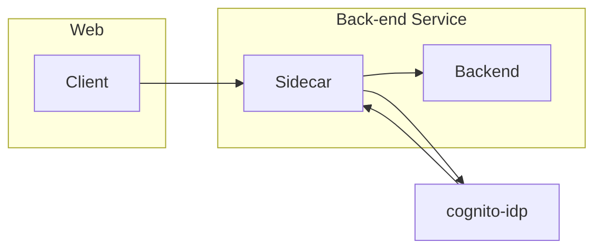

# Week 3 — Decentralized Authentication

## AWS Cognito with AWS Amplify

[User Pool Authentication flow](https://docs.aws.amazon.com/cognito/latest/developerguide/amazon-cognito-user-pools-authentication-flow.html)

Install AWS amplify (used for app development and auth)

```sh
npm i aws-amplify --save
```

## Provision Cognito User Group

Using the AWS Console we'll create a Cognito User Group
[Reference](https://docs.aws.amazon.com/cognito/latest/developerguide/tutorials.html)

## Configure Amplify

We need to hook up our cognito pool to our code in the `App.js`

```js
import { Amplify } from "aws-amplify";

Amplify.configure({
  AWS_PROJECT_REGION: process.env.REACT_AWS_PROJECT_REGION,
  aws_cognito_identity_pool_id:
    process.env.REACT_APP_AWS_COGNITO_IDENTITY_POOL_ID,
  aws_cognito_region: process.env.REACT_APP_AWS_COGNITO_REGION,
  aws_user_pools_id: process.env.REACT_APP_AWS_USER_POOLS_ID,
  aws_user_pools_web_client_id: process.env.REACT_APP_CLIENT_ID,
  oauth: {},
  Auth: {
    // We are not using an Identity Pool
    // identityPoolId: process.env.REACT_APP_IDENTITY_POOL_ID, // REQUIRED - Amazon Cognito Identity Pool ID
    region: process.env.REACT_AWS_PROJECT_REGION, // REQUIRED - Amazon Cognito Region
    userPoolId: process.env.REACT_APP_AWS_USER_POOLS_ID, // OPTIONAL - Amazon Cognito User Pool ID
    userPoolWebClientId: process.env.REACT_APP_AWS_USER_POOLS_WEB_CLIENT_ID, // OPTIONAL - Amazon Cognito Web Client ID (26-char alphanumeric string)
  },
});
```

## Conditionally show components based on logged in or logged out

Inside our `HomeFeedPage.js`

```js
import { Auth } from "aws-amplify";

// set a state
const [user, setUser] = React.useState(null);

// check if we are authenicated
const checkAuth = async () => {
  Auth.currentAuthenticatedUser({
    // Optional, By default is false.
    // If set to true, this call will send a
    // request to Cognito to get the latest user data
    bypassCache: false,
  })
    .then((user) => {
      console.log("user", user);
      return Auth.currentAuthenticatedUser();
    })
    .then((cognito_user) => {
      setUser({
        display_name: cognito_user.attributes.name,
        handle: cognito_user.attributes.preferred_username,
      });
    })
    .catch((err) => console.log(err));
};

// check when the page loads if we are authenicated
React.useEffect(() => {
  loadData();
  checkAuth();
}, []);
```

We'll want to pass user to the following components:

```js
<DesktopNavigation user={user} active={'home'} setPopped={setPopped} />
<DesktopSidebar user={user} />
```

We'll rewrite `DesktopNavigation.js` so that it it conditionally shows links in the left hand column
on whether you are logged in or not.

Notice we are passing the user to ProfileInfo

```js
import "./DesktopNavigation.css";
import { ReactComponent as Logo } from "./svg/logo.svg";
import DesktopNavigationLink from "../components/DesktopNavigationLink";
import CrudButton from "../components/CrudButton";
import ProfileInfo from "../components/ProfileInfo";

export default function DesktopNavigation(props) {
  let button;
  let profile;
  let notificationsLink;
  let messagesLink;
  let profileLink;
  if (props.user) {
    button = <CrudButton setPopped={props.setPopped} />;
    profile = <ProfileInfo user={props.user} />;
    notificationsLink = (
      <DesktopNavigationLink
        url="/notifications"
        name="Notifications"
        handle="notifications"
        active={props.active}
      />
    );
    messagesLink = (
      <DesktopNavigationLink
        url="/messages"
        name="Messages"
        handle="messages"
        active={props.active}
      />
    );
    profileLink = (
      <DesktopNavigationLink
        url="/@andrewbrown"
        name="Profile"
        handle="profile"
        active={props.active}
      />
    );
  }

  return (
    <nav>
      <Logo className="logo" />
      <DesktopNavigationLink
        url="/"
        name="Home"
        handle="home"
        active={props.active}
      />
      {notificationsLink}
      {messagesLink}
      {profileLink}
      <DesktopNavigationLink
        url="/#"
        name="More"
        handle="more"
        active={props.active}
      />
      {button}
      {profile}
    </nav>
  );
}
```

We'll update `ProfileInfo.js`

```js
import { Auth } from "aws-amplify";

const signOut = async () => {
  try {
    await Auth.signOut({ global: true });
    window.location.href = "/";
  } catch (error) {
    console.log("error signing out: ", error);
  }
};
```

We'll rewrite `DesktopSidebar.js` so that it conditionally shows components in case you are logged in or not.

```js
import "./DesktopSidebar.css";
import Search from "../components/Search";
import TrendingSection from "../components/TrendingsSection";
import SuggestedUsersSection from "../components/SuggestedUsersSection";
import JoinSection from "../components/JoinSection";

export default function DesktopSidebar(props) {
  const trendings = [
    { hashtag: "100DaysOfCloud", count: 2053 },
    { hashtag: "CloudProject", count: 8253 },
    { hashtag: "AWS", count: 9053 },
    { hashtag: "FreeWillyReboot", count: 7753 },
  ];

  const users = [{ display_name: "Andrew Brown", handle: "andrewbrown" }];

  let trending;
  if (props.user) {
    trending = <TrendingSection trendings={trendings} />;
  }

  let suggested;
  if (props.user) {
    suggested = <SuggestedUsersSection users={users} />;
  }
  let join;
  if (props.user) {
  } else {
    join = <JoinSection />;
  }

  return (
    <section>
      <Search />
      {trending}
      {suggested}
      {join}
      <footer>
        <a href="#">About</a>
        <a href="#">Terms of Service</a>
        <a href="#">Privacy Policy</a>
      </footer>
    </section>
  );
}
```

## Signin Page

```js
import { Auth } from "aws-amplify";

const [cognitoErrors, setCognitoErrors] = React.useState("");

const onsubmit = async (event) => {
  setCognitoErrors("");
  event.preventDefault();
  try {
    Auth.signIn(username, password)
      .then((user) => {
        localStorage.setItem(
          "access_token",
          user.signInUserSession.accessToken.jwtToken
        );
        window.location.href = "/";
      })
      .catch((err) => {
        console.log("Error!", err);
      });
  } catch (error) {
    if (error.code == "UserNotConfirmedException") {
      window.location.href = "/confirm";
    }
    setCognitoErrors(error.message);
  }
  return false;
};

let errors;
if (cognitoErrors) {
  errors = <div className="errors">{cognitoErrors}</div>;
}

// just before submit component
{
  errors;
}
```

## Signup Page

```js
import { Auth } from "aws-amplify";

const [cognitoErrors, setCognitoErrors] = React.useState("");

const onsubmit = async (event) => {
  event.preventDefault();
  setCognitoErrors("");
  try {
    const { user } = await Auth.signUp({
      username: email,
      password: password,
      attributes: {
        name: name,
        email: email,
        preferred_username: username,
      },
      autoSignIn: {
        // optional - enables auto sign in after user is confirmed
        enabled: true,
      },
    });
    console.log(user);
    window.location.href = `/confirm?email=${email}`;
  } catch (error) {
    console.log(error);
    setCognitoErrors(error.message);
  }
  return false;
};

let errors;
if (cognitoErrors) {
  errors = <div className="errors">{cognitoErrors}</div>;
}

//before submit component
{
  errors;
}
```

## Confirmation Page

```js
const resend_code = async (event) => {
  setCognitoErrors("");
  try {
    await Auth.resendSignUp(email);
    console.log("code resent successfully");
    setCodeSent(true);
  } catch (err) {
    // does not return a code
    // does cognito always return english
    // for this to be an okay match?
    console.log(err);
    if (err.message == "Username cannot be empty") {
      setCognitoErrors(
        "You need to provide an email in order to send Resend Activiation Code"
      );
    } else if (err.message == "Username/client id combination not found.") {
      setCognitoErrors("Email is invalid or cannot be found.");
    }
  }
};

const onsubmit = async (event) => {
  event.preventDefault();
  setCognitoErrors("");
  try {
    await Auth.confirmSignUp(email, code);
    window.location.href = "/";
  } catch (error) {
    setCognitoErrors(error.message);
  }
  return false;
};
```

## Recovery Page

````js
import { Auth } from 'aws-amplify';

const onsubmit_send_code = async (event) => {
  event.preventDefault();
  setCognitoErrors('')
  Auth.forgotPassword(username)
  .then((data) => setFormState('confirm_code') )
  .catch((err) => setCognitoErrors(err.message) );
  return false
}

const onsubmit_confirm_code = async (event) => {
  event.preventDefault();
  setCognitoErrors('')
  if (password == passwordAgain){
    Auth.forgotPasswordSubmit(username, code, password)
    .then((data) => setFormState('success'))
    .catch((err) => setCognitoErrors(err.message) );
  } else {
    setCognitoErrors('Passwords do not match')
  }
  return false
}

## Authenticating Server Side

Add in the `HomeFeedPage.js` a header to pass along the access token

```js
  headers: {
    Authorization: `Bearer ${localStorage.getItem("access_token")}`
  }
````

In the `app.py`, add `Authorization` to `allow_headers` in `flask-cors` `CORS` call.

```python
cors = CORS(
    app,
    resources={r"/api/*": {"origins": origins}},
    expose_headers="location,link",
    allow_headers=["content-type", "if-modified-since", "traceparent", "Authorization"],
    methods="OPTIONS,GET,HEAD,POST"
)
```

## Different approach to JWT Tokens

- Implement in App, can use [flask-middleware](https://github.com/FranciscoCarbonell/flask-middleware) for minimum code with decorators
- [11:35 Using sidecar container pattern](https://youtu.be/nJjbI4BbasU?t=695)
  - For implementation steps, see Sidecar container pattern with Aws-jwt-verify.js section. For code, go to week-3-sidecar branch
- [13:17 Using API gateway](https://youtu.be/nJjbI4BbasU?t=796)
- [23:10 Reasons for not using API Gateway](https://youtu.be/nJjbI4BbasU?t=1394)

### Troubleshooting

1. How do I resolve `invalid code error` when entering verification code in Confirm page?  
   Amplify `Auth.confirmSignUp` function takes in a username and code for verification. The homework solution uses the same value for username and email which is not allowed by AWS Cognito. By changing the `ConfirmPage` to ask for username instead resolves it. For email verification, setup user pool to send email verification email instead.

2. How do I resolve `invalid username and password` when signing in with correct username and password?  
   Homework solution creates user pool with no MFA enabled and by default allows `USER_SRP_AUTH`. Amplify Auth by default uses `USER_SRP_AUTH` flow for authentication. It is recommend to use `USER_SRP_AUTH` as the user password never leaves the application.
   To get homework solution working, we can add `ALLOW_USER_PASSWORD_AUTH` to Authentication flows under `Amazon Cognito > User pools > cruddur-user-pool > App client: cruddur-app-client > Edit app client information` and supply `authenticationFlowType: 'USER_PASSWORD_AUTH'` in our amplify configuration so it use `USER_PASSWORD_AUTH` which sends user password unencrypted to cognito instead.

## Sidecar container pattern with Aws-jwt-verify.js

References:

- https://ilhicas.com/2023/01/26/How-to-run-a-sidecar-in-docker-compose.html
- https://iximiuz.com/en/posts/service-proxy-pod-sidecar-oh-my/
- Asked chatgpt about how to run a proxy nodejs server



In the graph, cognito-idp endpoint is used by `aws-jwt-verify` to retrieve `jwks.json` and stored in cache used to verify access tokens. In our case, it is optional because we only use one user pool so we can download it beforehand to store within verify service and read it before we verify tokens.

`network_mode` in `docker-compose`  
In order to run a sidecar pattern in docker-compose, we will make use of the service `network_mode`, which allows us to run a service in the same network namespace as another service. By only exposing one service to external networks we can control the flow of requests.

1. Add the following to docker-compose:

```yml
services:
  # other services...
  backend-flask:
    # other attributes ...
    network_mode: "service:jwt-verify-sidecar"
  jwt-verify-sidecar:
    build:
      context: ./jwt-verify-sidecar
      target: development
    environment:
      BACKEND_URL: ${BACKEND_URL}
      AWS_COGNITO_USER_POOL_ID: ${AWS_COGNITO_USER_POOL_ID}
      AWS_COGNITO_APP_CLIENT_ID: ${AWS_COGNITO_APP_CLIENT_ID}
    volumes:
      - ./jwt-verify-sidecar:/jwt-verify-sidecar
    ports:
      - 4567:4567
```

2. create a `jwt-verify-sidecar` folder at the project root directory
3. Run the following commands

```sh
cd ./jwt-verify-sidecar
npm init -y
# make sure the jwks.json is in .gitignore so it doesn't get added to commits
curl https://cognito-idp.ca-central-1.amazonaws.com/ca-central-1_XSVrTEgqD/.well-known/jwks.json -o jwks.json
# aws-jwt-verify for verification
# cors used for nodejs cors configuration
# dotenv used to load environment variables from .env file if needed
npm i aws-jwt-verify cors dotenv
# used for hot reload (no need to restart server when making code edits in development)
npm i --save-dev nodemon
```

4. Create a `Dockerfile` in the `jwt-verify-sidecar` directory with the following content(support development only):

```Dockerfile
FROM node:18.13 as development

COPY . /jwt-verify-sidecar

WORKDIR /jwt-verify-sidecar

RUN npm install

EXPOSE 4567

CMD ["npm", "run", "dev"]
```

5. Update the `package.json` in `jwt-verify-sidecar` directory to have the following scripts:
```json
//...
"scripts": {
    "start": "node index.js",
    "dev": "nodemon index.js"
},
//...
```

6. Update the `Dockerfile` for `backend-flask` to run on a different port than the original port as we will let sidecar listen on that port instead:
```Dockerfile
# remove or comment out EXPOSE ${PORT}
CMD [ "python3", "-m" , "flask", "run", "--host=127.0.0.1", "--port=4568"]
```

7. Create `index.js` with the following content, make sure the target is using the correct port now backend-flask switched to:
```js
const { CognitoJwtVerifier } = require("aws-jwt-verify");
const http = require("http");
const httpProxy = require("http-proxy");
const { config } = require("dotenv");
const { readFileSync } = require("fs");

config();
const port = 4567;

const jwtVerifier = CognitoJwtVerifier.create({
  userPoolId: process.env.AWS_COGNITO_USER_POOL_ID,
  tokenUse: "access",
  clientId: process.env.AWS_COGNITO_APP_CLIENT_ID,
});

const jwks = JSON.parse(readFileSync("jwks.json", { encoding: "utf-8" }));
jwtVerifier.cacheJwks(jwks);

const proxy = httpProxy.createProxyServer({});
const server = http.createServer(async (req, res) => {
  res.setHeader(
    "Access-Control-Allow-Headers",
    "Authorization, traceparent, Content-Type"
  );
  res.setHeader("Access-Control-Allow-Methods", "GET, POST, HEAD, OPTIONS");
  console.log(req.headers);

  if (req.headers["authorization"]) {
    const token = req.headers["authorization"].split(" ")[1];
    const res = await jwtVerifier.verify(token);
    console.log(res);
  }
  // If the app does not support unauthenticated content and redirects to signing page if not authenticated
  //else (!token) {
  //   res.statusCode = 401;
  //   res.end(JSON.stringify({ error: "User is not authenticated." }));
  //   return;
  // }
  proxy.web(req, res, {
    target: "http://localhost:4568",
  });
});

server.on("error", (err) => {
  console.error(`Server error: ${err}`);
});

server.listen(port);
```
7. Re-build your `backend-flask` image with `docker build --no-cache`
8. Run `docker compose up` at the project root directory and you should see that the app works the same but in docker logs you will see sidecar is getting the requests before proxying it to the backend

### Troubleshooting & FAQ

1. How to resolve docker-compose up giving cycle found?  
   Check that the services in cycle is not referencing each other with `depends_on` or `network_mode: service:...` that creates a cycle.
2. What is `aws-cognito-signin.user.admin` scope?
   Scope can be a combination of any system-reserved scopes or custom scopes that are associated with a client. Scopes must be separated by spaces. System reserved scopes are openid, email, phone, profile, and aws.cognito.signin.user.admin. Any scope used must be associated with the client, or it will be ignored at runtime.  
   If the client doesn't request any scopes, the authentication server uses all scopes that are associated with the client.  
   An ID token is only returned if openid scope is requested. The access token can be only used against Amazon Cognito user pools if aws.cognito.signin.user.admin scope is requested. The phone, email, and profile scopes can only be requested if openid scope is also requested. These scopes dictate the claims that go inside the ID token.
